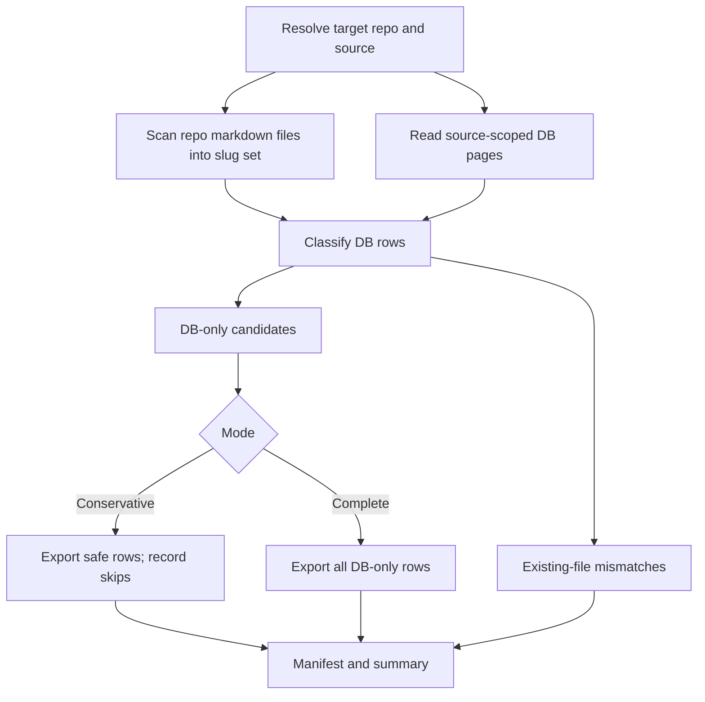

# feat: Export DB-only pages for brain reconciliation

**Target repo:** gbrain

## Summary

Add a conservative, missing-only reconciliation export path to the GBrain CLI so operators can recover default-source pages that exist in Postgres/Supabase but have no corresponding markdown file in the brain repo. The implementation should preserve the current all-pages `gbrain export` behavior, use source-scoped DB reads, and stage recovery through audit/dry-run reporting before any markdown files are written.

---

## Problem Frame

GBrain currently treats Postgres as both an index and a write surface. Sync is commit-delta based, so DB-only pages can persist when writers such as ingest or enrichment create rows outside the markdown repo path, or when the sync checkpoint already matches the repo HEAD. This plan turns that divergence into an explicit reconciliation workflow instead of relying on normal sync to discover rows that have no filesystem counterpart.

---

## Requirements

- R1. By default, recover only pages that exist in the default GBrain source and do not have a corresponding markdown file in the target brain repo.
- R2. Support two-stage operation: audit/dry-run first, then an explicit write mode.
- R3. Default to conservative export that skips obvious operational noise while making skipped rows visible.
- R4. Provide an explicit complete mode that exports every DB-only candidate, including rows conservative mode would skip.
- R5. Never delete Supabase rows, repo files, source registrations, sync checkpoints, embeddings, or git history.
- R6. Never overwrite an existing markdown file; present-on-both content differences are reported as mismatches, not modified.
- R7. Preserve page content and frontmatter using existing GBrain/Tolaria-compatible markdown serialization.
- R8. Produce a machine-readable manifest and concise operator summary with counts for candidates, exported pages, skips, mismatches, and errors.
- R9. Work safely from a local Mac repo or gateway clone when the operator points the command at the intended repo.
- R10. Be repeatable: rerunning after a successful export should reduce DB-only candidates without creating duplicates.
- R11. Keep multi-source pages out of v1 unless the operator explicitly selects a non-default source.
- R12. Keep the existing all-pages export behavior intact for callers already using `gbrain export --dir`.

**Origin actors:** A1 Operator, A2 Local agent, A3 GBrain worker, A4 downstream planner/implementer
**Origin flows:** F1 Audit candidate export set, F2 Conservative export, F3 Complete recovery export
**Origin acceptance examples:** AE1 default dry-run finds DB-only rows, AE2 conservative write exports safe rows and skips noise, AE3 complete mode exports skipped rows, AE4 existing-file mismatch is reported but not overwritten, AE5 multi-source rows are excluded by default

---

## Scope Boundaries

- No purge, prune, or deletion behavior for DB rows or repo files.
- No automatic git commit, push, branch creation, or PR creation.
- No rewrite of sync checkpoint semantics, import architecture, ingest behavior, enrichment behavior, or source registration.
- No raw `.raw` sidecar recovery in this reconciliation path; v1 writes markdown pages only.
- No promise that exported pages are semantically perfect knowledge; this workflow restores missing markdown artifacts and reports what it did.

### Deferred to Follow-Up Work

- Multi-source bulk reconciliation beyond default-source recovery: a future iteration can decide whether each isolated source should export back to its own local path.
- Automated post-export sync/embed orchestration: leave it to operators or existing worker behavior for v1.
- Content-level merge tooling for pages that exist in both DB and repo but differ.

---

## Context & Research

### Relevant Code and Patterns

- `src/commands/export.ts` already implements the all-pages markdown dump; preserve this path and add the reconciliation mode without changing its default semantics.
- `src/cli.ts` owns CLI-only command routing and help text for `export`.
- `src/core/markdown.ts` provides `serializeMarkdown`, which should remain the single markdown renderer for exported pages.
- `src/core/brain-writer.ts` provides repo-bound `writeBrainPage`, path guarding, and directory creation.
- `src/core/sync.ts` provides `isSyncable`, `pathToSlug`, and `slugifyPath`, which should define the filesystem side of "corresponding markdown file."
- `src/core/source-resolver.ts` defines source resolution priorities and local path matching.
- `src/commands/sources.ts` shows direct `executeRaw` usage for source-scoped CLI behavior.
- `test/multi-source-integration.test.ts`, `test/sources.test.ts`, `test/source-resolver.test.ts`, and `test/sync.test.ts` are the strongest local patterns for source-aware tests and filesystem sync behavior.

### Institutional Learnings

- ByteRover notes for GBrain ingest emphasize that ingest can write markdown when `sources.local_path` exists, then import into Postgres, while enrichment can create derived DB pages directly.
- ByteRover notes for source-aware upgrades show that newer GBrain behavior groups work by `source_id`; this reconciliation must keep that source boundary explicit.

### External References

- None. Local code and the upstream requirements document are sufficient; this feature extends established GBrain CLI/source patterns rather than adopting a new external framework.

---

## Key Technical Decisions

- Add the new behavior as `gbrain export missing`: this keeps reconciliation discoverable next to the current export command while preserving the current all-pages dump and avoiding ambiguity with `gbrain export --dir`.
- Use source-scoped DB enumeration rather than `getPage` or `listPages`: current page helpers are not source-aware enough for duplicate slugs across sources, and the observed ambiguity is part of the divergence problem.
- Classify filesystem presence by scanning the target repo with existing syncability and slug helpers: this aligns export recovery with what sync/import would consider a page.
- Reuse `serializeMarkdown` and `writeBrainPage`: this avoids a second markdown dialect and keeps writes guarded under the chosen repo path.
- Require an explicit repo target unless the current working directory can be safely resolved to the intended source local path: this reduces the risk of exporting into the gateway clone when the operator meant the local brain repo, or vice versa.
- Treat conservative skips as first-class manifest entries, not hidden exclusions: this satisfies two-stage mode while making complete-mode decisions auditable.

---

## Open Questions

### Resolved During Planning

- Where should the implementation live? In the GBrain CLI repo, because the workflow needs engine access, source-scoped queries, markdown serialization, and safe writer helpers.
- Should this alter normal sync? No. The plan adds an operator-triggered recovery export and leaves sync semantics unchanged.
- Should raw data sidecars be restored? No for v1. The origin request is DB-only pages, and writing `.raw` sidecars into the wiki repo increases blast radius without being necessary for markdown reconciliation.

### Deferred to Implementation

- Exact conservative skip rules: implement them as a small, tested helper, starting from deterministic slug/type/tag/title signals for operational noise. The manifest must explain every skip so the rule can be refined later without data loss.
- Exact manifest default path and output formatting: decide during CLI wiring based on existing command output conventions, while preserving the required manifest fields.
- Exact source-scoped query shape: keep it source-aware and read-only, but let implementation choose the most maintainable query/helper boundary after adding tests.

---

## High-Level Technical Design

> *This illustrates the intended approach and is directional guidance for review, not implementation specification. The implementing agent should treat it as context, not code to reproduce.*

---

## Implementation Units

- U1. **Source-scoped reconciliation classifier**

**Goal:** Build the read-only classification layer that compares source-scoped DB pages with markdown files in the target repo and identifies DB-only candidates, existing-file mismatches, and non-candidates.

**Requirements:** R1, R5, R6, R9, R10, R11, AE1, AE4, AE5

**Dependencies:** None

**Files:**
- Create: `src/core/export-reconciliation.ts`
- Test: `test/export-reconciliation.test.ts`

**Approach:**
- Add a core helper for reconciliation classification so CLI parsing remains thin.
- Enumerate DB pages for a single `source_id` with a read-only, source-scoped path that avoids slug ambiguity across sources.
- Scan the target repo for syncable markdown files and derive slugs with the same helpers used by sync/import.
- Classify rows without writing: DB-only, present in repo, mismatch/report-only, skipped-by-source, and error cases.
- For slugs that already exist in the repo, compare the DB page rendered through the existing markdown serializer with the existing markdown parsed through existing markdown utilities; classify material differences as report-only mismatches.

**Execution note:** Start test-first with PGLite-backed and filesystem-backed characterization of default-source vs non-default-source behavior before wiring CLI writes.

**Patterns to follow:**
- `test/multi-source-integration.test.ts` for PGLite multi-source setup.
- `test/sync.test.ts` for temp repo and syncability expectations.
- `src/commands/sources.ts` for source-aware raw query boundaries.

**Test scenarios:**
- Happy path: a default-source DB page whose slug has no syncable markdown file is classified as DB-only.
- Happy path: a default-source DB page whose slug has an existing markdown file is not classified for export.
- Happy path: a present-on-both page whose DB content differs from the repo markdown is classified as a mismatch and not as an export candidate.
- Edge case: a hidden file, meta file, `.raw` file, or ignored path in the repo does not count as a valid markdown counterpart.
- Edge case: the same slug in a non-default source is excluded when default source is selected.
- Error path: an invalid or missing repo path produces a classification error without DB mutation.
- Integration: duplicate slugs in two sources do not cause ambiguous `getPage` behavior because classification uses source-scoped enumeration.

**Verification:**
- Classification can produce a complete candidate set without creating, modifying, or deleting files.
- Multi-source rows stay isolated unless explicitly selected.

---

- U2. **Markdown materialization and manifest reporting**

**Goal:** Convert DB-only candidates into markdown files only when write mode is explicitly requested, and record every exported, skipped, mismatched, and failed row in a manifest.

**Requirements:** R2, R3, R4, R5, R6, R7, R8, R10, AE2, AE3, AE4

**Dependencies:** U1

**Files:**
- Modify: `src/core/export-reconciliation.ts`
- Test: `test/export-reconciliation.test.ts`

**Approach:**
- Reuse `serializeMarkdown` for page rendering and `writeBrainPage` for guarded repo writes.
- Keep dry-run as the default read/report path for the reconciliation mode; write mode must be explicit.
- Add conservative and complete modes as classification/materialization policy, not separate code paths.
- Record counts and per-page outcomes in a manifest shape that is stable enough for agents and operators to inspect.
- Treat existing files as hard no-overwrite boundaries even if serialized DB content differs.

**Execution note:** Implement new behavior test-first around dry-run, write, conservative skip, complete mode, and rerun idempotence.

**Patterns to follow:**
- `src/core/markdown.ts` for page serialization.
- `src/core/brain-writer.ts` for safe writes under a source path.
- `src/commands/import.ts` for summary-oriented command outcomes.

**Test scenarios:**
- Covers AE2. Happy path: conservative write creates markdown for a safe DB-only page and records it as exported.
- Covers AE3. Happy path: complete mode exports a DB-only page that conservative mode records as skipped.
- Happy path: dry-run records exportable candidates but leaves the filesystem unchanged.
- Edge case: rerunning after export reports the page as present rather than exporting a duplicate.
- Error path: a candidate whose target path would escape the repo is rejected and recorded as an error.
- Error path: an existing markdown file is never overwritten and is recorded as a mismatch/report-only outcome.
- Integration: the manifest summary counts equal the number of per-page outcomes.

**Verification:**
- Write mode creates only missing `.md` files under the target repo.
- Dry-run and manifest output are sufficient to decide whether to run complete mode.

---

- U3. **CLI integration for missing-only export mode**

**Goal:** Expose the reconciliation workflow through the GBrain CLI without breaking current `gbrain export --dir` behavior.

**Requirements:** R2, R3, R4, R8, R9, R11, R12, F1, F2, F3

**Dependencies:** U1, U2

**Files:**
- Modify: `src/commands/export.ts`
- Modify: `src/cli.ts`
- Test: `test/export-command.test.ts`

**Approach:**
- Extend export command parsing with `gbrain export missing` as the missing-only reconciliation mode.
- Preserve the current export command path and its default output directory semantics.
- Support source selection, repo target selection, conservative vs complete mode, dry-run vs write, manifest output, and JSON-friendly summary output on the missing mode.
- Use existing source resolution behavior where safe, but prefer explicit repo targeting for write operations.
- Keep CLI output concise for humans and structured enough for agents.

**Execution note:** Add command-level tests before changing CLI dispatch/help text so existing export behavior is protected.

**Patterns to follow:**
- `src/commands/export.ts` for current export command structure.
- `src/cli.ts` for CLI-only command routing and help text.
- `test/sources.test.ts` for command tests with stubbed engine behavior and exit capture.

**Test scenarios:**
- Happy path: current all-pages export still writes to the requested export directory when reconciliation mode is not selected.
- Happy path: `gbrain export missing` dry-run calls the reconciliation classifier and prints candidate counts.
- Happy path: write mode calls materialization and surfaces exported/skipped/mismatch counts.
- Edge case: a requested non-default source is honored but default remains the implicit source.
- Error path: write mode without a safe repo target fails before filesystem writes.
- Error path: invalid flag combinations produce a clear command error without falling through to all-pages export.
- Integration: CLI help includes the missing-only mode without removing the existing export help.

**Verification:**
- Existing export callers keep working.
- Operators can discover and run the two-stage DB-only workflow from CLI help.

---

- U4. **End-to-end reconciliation coverage**

**Goal:** Add integration coverage that proves the command works against a realistic source-aware DB and temporary brain repo.

**Requirements:** R1, R2, R4, R5, R6, R9, R10, R11, AE1, AE2, AE3, AE4, AE5

**Dependencies:** U1, U2, U3

**Files:**
- Create: `test/e2e/export-reconciliation.test.ts`

**Approach:**
- Use a temp git-backed markdown repo and a PGLite database with default and non-default sources.
- Seed DB rows for safe DB-only pages, conservative-skip pages, present-on-both pages, mismatch pages, and non-default-source pages.
- Exercise dry-run, conservative write, complete write, and rerun behavior through the command boundary where practical.
- Keep assertions focused on filesystem outcomes, DB immutability, manifest counts, and source isolation.

**Execution note:** Prefer end-to-end tests that fail against the current implementation before adding command wiring.

**Patterns to follow:**
- `test/e2e/sync.test.ts` for temp git repo setup.
- `test/multi-source-integration.test.ts` for source seeding.

**Test scenarios:**
- Covers AE1. Integration: dry-run reports default-source DB-only candidates without writing files.
- Covers AE2. Integration: conservative write creates only safe DB-only markdown and records operational skips.
- Covers AE3. Integration: complete write exports the conservative-skip candidate on explicit request.
- Covers AE4. Integration: existing markdown content is not overwritten even when DB content differs.
- Covers AE5. Integration: a DB-only page in another source is ignored by default.
- Error path: a failed filesystem write is recorded without DB deletion or partial repo cleanup.

**Verification:**
- The reconciliation command is proven across DB, source metadata, CLI, manifest, and filesystem boundaries.

---

- U5. **Operator documentation and guidance**

**Goal:** Document why DB-only divergence can happen, how to audit/export DB-only pages safely, and what remains intentionally outside v1.

**Requirements:** R2, R3, R4, R5, R8, R9, R12

**Dependencies:** U3

**Files:**
- Modify: `README.md`
- Modify: `docs/guides/live-sync.md`
- Modify: `docs/guides/multi-source-brains.md`
- Modify: `docs/guides/gbrain-ingest.md`
- Modify: `docs/GBRAIN_V0.md`

**Approach:**
- Explain that Postgres can contain pages created by ingest/enrichment or prior sync history that do not exist in the markdown repo.
- Show the two-stage workflow conceptually: audit first, then conservative write, then complete mode only when the manifest justifies it.
- Clarify default-source behavior and the non-goals around DB deletion, git operations, sync checkpoint rewrites, and raw sidecars.
- Keep examples generic and avoid real personal, company, or fund names.

**Patterns to follow:**
- Existing CLI sections in `README.md` and `docs/GBRAIN_V0.md`.
- Existing source model explanations in `docs/guides/multi-source-brains.md`.
- Existing ingest write-path explanation in `docs/guides/gbrain-ingest.md`.

**Test scenarios:**
- Test expectation: none -- documentation-only unit. Documentation should be reviewed for consistency with implemented CLI names and flags.

**Verification:**
- Documentation explains the divergence path and gives operators enough guidance to run the workflow without accidentally treating it as destructive sync.

---

## System-Wide Impact

- **Interaction graph:** The change touches the CLI export entry point, source metadata reads, engine read paths, markdown serialization, and guarded filesystem writes.
- **Error propagation:** DB read, repo scan, serialization, and write failures should be represented in command output and manifest entries without aborting unrelated dry-run classification where possible.
- **State lifecycle risks:** The workflow must not mutate DB state, sync checkpoints, embeddings, or git state. Filesystem writes are the only intended side effect and only in explicit write mode.
- **API surface parity:** The public CLI help and docs must preserve current export behavior while making the missing-only mode discoverable.
- **Integration coverage:** Unit tests are not enough because the risk spans source metadata, DB rows, slug derivation, command parsing, and filesystem writes.
- **Unchanged invariants:** Normal `sync`, `import`, ingest, enrichment, and all-pages export semantics remain unchanged.

---

## Risks & Dependencies

| Risk | Mitigation |
|------|------------|
| Source-scoped queries drift from engine abstractions | Keep the source-aware read path small, tested, and read-only; follow existing `sources` command raw-query conventions. |
| Conservative mode skips too much or too little | Make every skip visible in the manifest and provide complete mode as an explicit recovery path. |
| Existing files are accidentally overwritten | Treat filesystem presence as a hard boundary and cover no-overwrite behavior in unit and integration tests. |
| Local repo vs gateway clone confusion | Prefer explicit repo targeting for writes and validate target path before materialization. |
| Serialization changes create noisy diffs | Use existing `serializeMarkdown` and document that reconciliation exports DB state into the current canonical markdown format. |
| Public docs expose private examples | Use generic examples only, per repo privacy guidance. |

---

## Documentation / Operational Notes

- This is an operator-triggered recovery workflow, not a background daemon and not a replacement for Hermes or normal sync.
- After exporting pages, operators can inspect ordinary markdown diffs before deciding whether to commit, sync, or embed.
- The manifest is part of the operational contract; it should be useful for both humans and follow-up agents.

---

## Sources & References

- Origin document: `gbrain-brain:docs/brainstorms/2026-04-29-gbrain-db-only-export-reconciliation-requirements.md`
- Related code: `src/commands/export.ts`
- Related code: `src/cli.ts`
- Related code: `src/core/markdown.ts`
- Related code: `src/core/brain-writer.ts`
- Related code: `src/core/sync.ts`
- Related code: `src/core/source-resolver.ts`
- Related tests: `test/multi-source-integration.test.ts`
- Related tests: `test/sources.test.ts`
- Related tests: `test/sync.test.ts`
- Related docs: `docs/guides/live-sync.md`
- Related docs: `docs/guides/multi-source-brains.md`
- Related docs: `docs/guides/gbrain-ingest.md`
